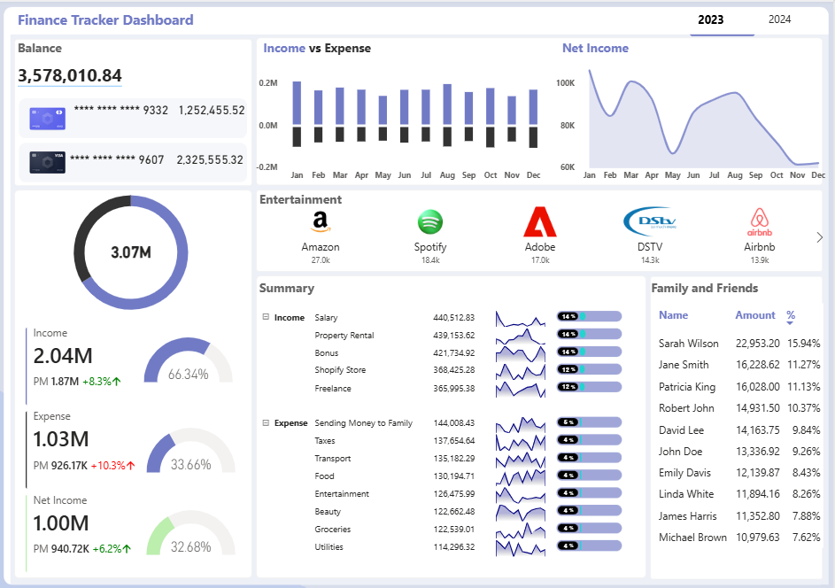

# Personal-Finance-Tracker-Dashboard (Excel + Power-BI)
End-to-end personal finance analytics project using Excel and Power BI to clean, model, analyze, and visualize financial transactions.

## Project Overview

This is an end-to-end financial analytics project designed to provide a clear view of personal financial activity across accounts, transactions, categories, and recipients. The project transforms transaction-level data into an interactive dashboard that allows users to monitor balances, analyze income and expenses, track monthly financial performance, identify major spending categories and recipients, and understand transaction trends over time.

The data was prepared and validated using **Microsoft Excel**, including data cleaning, standardization, and preparation for analysis. **Power BI** was then used to build a relational data model, create a dedicated calendar table, develop DAX measures for financial and time-based analysis, and deliver an interactive dashboard with dynamic filtering, conditional formatting, contribution analysis, and custom SVG-based visuals.

## Problem Statement

Managing personal finances across multiple accounts and transactions can make it difficult to understand where money is coming from, where it is being spent, and understanding the overall financial activity at a glance.

I wanted a single view that could answer, quickly:
- How much am I spending vs earning, and is that trend improving or worsening?
- Which categories (and which people/recipients) is my money actually going to?
- How does this month compare to last month and by how much?
- Can I see this by account, by card, by category, or by recipient without rebuilding the view each time?

Goal: To design and build a finance tracker that answers these questions in one interactive dashboard, with the data properly cleaned and modelled for analysis.

## Data Disclaimer

The financial data used in this project is **sample data** created for analytical and demonstration purposes. It does not represent real personal financial information or actual transactions.

## Project Objectives

The objective of this project was to transform transaction-level financial data into an interactive reporting solution that provides a consolidated view of financial activity and supports faster, more informed decision-making.

The project was designed to:
- Prepare and validate transaction data for analysis using Microsoft Excel.
- Build a structured relational data model in Power BI using fact and dimension tables.
- Create time-based analysis using a dedicated calendar table and DAX time-intelligence measures.
- Monitor key financial metrics including balances, income, expenses, and net income.
- Analyze financial activity by transaction type, category, subcategory, and recipient.
- Develop an interactive dashboard that enables users to explore financial performance and trends at a glance.

## Tools & Technologies

- **Microsoft Excel** - Data preparation, cleaning, validation, and initial data review.
- **Power BI** - Data modelling, DAX calculations, interactive visualization, and dashboard development.
- **DAX** - Time intelligence, financial metrics, variance and growth analysis, contribution analysis, and custom SVG visuals.

## Data Preparation

The project began with multiple financial datasets containing transaction, account, category, subcategory, and recipient information. The datasets were reviewed and prepared in Microsoft Excel before being imported into Power BI.

The preparation process included:

- Reviewing the structure and purpose of each dataset.
- Identifying fact and dimension tables for the analytical model.
- Standardizing column names and data formats.
- Reviewing data types, particularly dates and numerical fields.
- Checking for missing values and inconsistencies.
- Reviewing the datasets for duplicate or invalid records.
- Cleaning and validating transaction-level data where necessary.
- Preparing recipient and category-related lookup data for analysis.
- Performing data-quality checks before loading the data into Power BI.

The cleaned and validated datasets were then used as the foundation for the Power BI data model and dashboard.

## Data Modelling

The prepared datasets were imported into Power BI and structured into a relational data model to support flexible filtering and analysis.

The model was organized around a central `Fact_Finance` transaction table supported by dimension tables for accounts, categories, recipients, subcategories, and dates.

Key modelling steps included:

- Identifying `Fact_Finance` as the central transaction table.
- Creating and structuring the required dimension tables.
- Creating a dedicated `dim_Subcategory` table to improve the organization of subcategory information.
- Merging the required subcategory information into the appropriate dimension structure.
- Establishing relationships between the fact table and dimension tables using their corresponding keys.
- Creating a dedicated `Calendar` table covering the minimum and maximum transaction dates.
- Connecting the Calendar table to `Fact_Finance` to support consistent date filtering and time-based analysis.
- Creating a dedicated measures table to organize the project's DAX measures separately from the underlying data tables.

## DAX & Analytical Calculations

DAX measures were created in Power BI to transform the transaction data into meaningful financial metrics and support dynamic analysis.

The measures covered several areas:

- **Core financial metrics:** Total Amount, Income, Expense, Net Income, and Total Balance.
- **Time intelligence:** Previous-month Income, Expense, and Net Income using the Calendar table.
- **Variance analysis:** Current-period versus previous-period variance for income, expenses, and net income.
- **Growth analysis:** Percentage growth measures to identify changes in financial performance.
- **Dynamic indicators:** Conditional color measures and percentage indicators with directional arrows to communicate positive and negative movements.
- **Contribution analysis:** Measures to determine the contribution of individual categories and recipients to overall transaction value.
- **Custom visual calculations:** SVG-based measures used to create contribution progress bars and monthly transaction sparklines.

These measures were organized in a dedicated measures table to keep the model structured and make the dashboard calculations easier to manage.

## Dashboard & Visualizations

The final Power BI dashboard was designed to provide a consolidated view of financial activity and allow users to explore their finances interactively.

Key dashboard components include:

- **Financial overview:** KPI cards displaying account balances, income, expenses, and overall transaction value.
- **Transaction composition:** Donut charts showing the distribution of financial activity across transaction types and categories.
- **Monthly performance:** Current-month and previous-month comparisons for income, expenses, and net income, supported by variance and growth indicators.
- **Income vs. Expense analysis:** A comparative monthly view of money flowing into and out of the accounts.
- **Net income trend:** An area chart showing how net income changes over time.
- **Category analysis:** An interactive matrix showing transaction types, categories, total amounts, and each category's contribution to overall transaction value.
- **Trend analysis:** Custom SVG sparklines showing how transaction amounts change across months for individual categories.
- **Recipient analysis:** A recipient-level view showing transaction amounts and each recipient's contribution to total financial activity.
- **Interactive filtering:** Slicers and category selections allow users to dynamically explore different periods, transaction types, and categories.
- **Dynamic visual indicators:** Conditional formatting, directional arrows, contribution bars, and custom SVG elements were used to make changes and proportions easier to interpret.

## Key Insights

The dashboard provides a consolidated view of financial activity and highlights patterns across income, expenses, categories, monthly performance, and recipients.

Key findings from the analysis include:
- Net-income margin held steady at around 49% despite a 34% drop in income. Income fell from 2.04M to 1.34M, while expenses declined at a similar rate from 1.03M to 683K, showing that spending remained broadly aligned with lower earnings.
- The income mix became less dependent on salary and rental income. Salary declined by 44% and Property Rental by 41%, while  Freelance  and business related income were comparatively more resilient, declining by 25% and 27% respectively.
- Expense concentration remained relatively low. No single expense category dominated spending in either year, with major categories such as family transfers, taxes, transport, food, and utilities contributing relatively similar amounts.
- Recipient concentration increased despite lower recipient spending. Sarah Wilson's share of recipient-related transactions rose from 15.9% to 17.5%, meaning recipient spending became slightly more concentrated around the top recipient in 2024.

## Recommendations

- **Strengthen resilient income streams:** Continue monitoring and developing freelance and business-related income sources, which showed greater resilience as overall income declined.
- **Investigate the drivers of income decline:** Determine why salary and rental income fell significantly and assess whether the decline is temporary or structural.
- **Monitor recipient concentration:** Track recipient share alongside total amounts, since concentration can increase even when overall spending declines.
